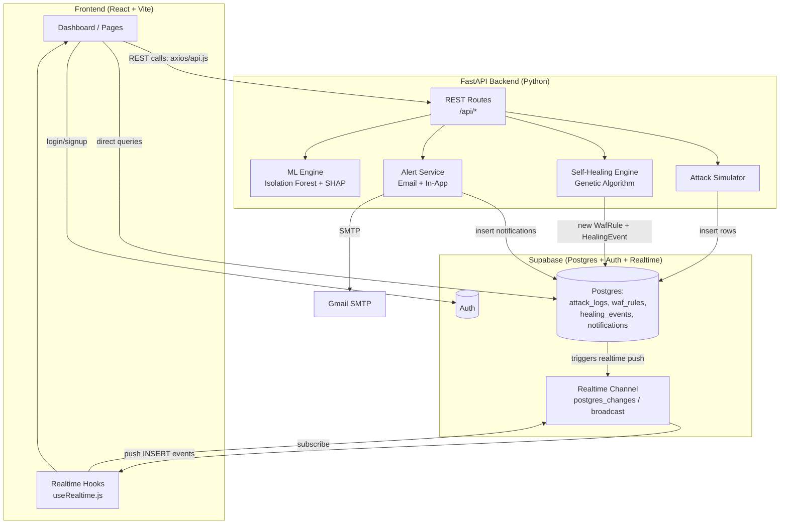
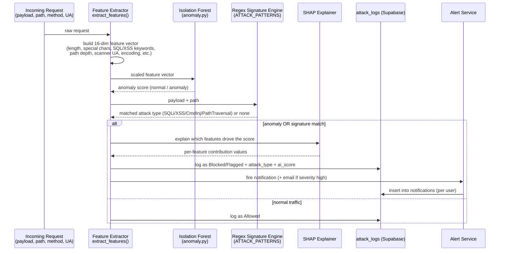
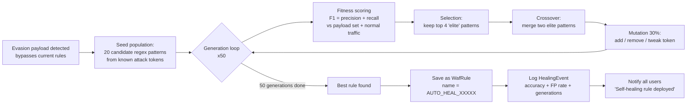
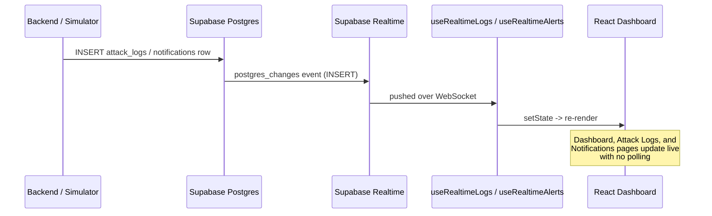
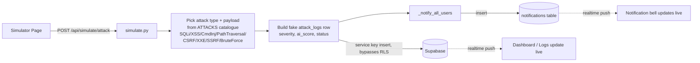

# EVOSHIELD (SH-WAF) — System Working Flow

This document explains **how the system works end-to-end**: request flow, detection pipeline, self-healing loop, and how the frontend stays in sync in real time.

---

## 1. High-Level Architecture

**Two parallel data paths:**
- **Frontend ↔ Supabase directly** — auth, reading logs/rules, and realtime subscriptions (fast, no backend hop).
- **Frontend ↔ FastAPI backend** — anything that needs computation: ML inference, SHAP explanations, genetic-algorithm rule generation, attack simulation, email alerts.

---

## 2. Request Detection Flow (the actual "firewall" logic)

- **Hybrid detection** = ML (Isolation Forest, catches *unknown* attacks) + Regex signatures (catches *known* attack patterns fast).
- **SHAP** turns the black-box ML score into an explainable breakdown ("SQL Keywords contributed +0.8").
- Endpoints: `POST /api/ml/inference` (predict), `POST /api/ml/shap` (explain).

---

## 3. Self-Healing Flow (Genetic Algorithm)

This is what makes the WAF "self-healing" — when an attack **evades** existing rules, the system evolves a brand-new rule automatically instead of waiting for a human.

- Endpoint: `POST /api/healing/trigger` (also mirrored at `POST /api/ml/healing/trigger` for direct ML testing).
- Rule and event are persisted (`waf_rules`, `healing_events` tables) so the frontend's **Self-Healing page** can show history.

---

## 4. Realtime UI Update Flow

- The frontend never polls — it subscribes once (`supabase.channel(...).on('postgres_changes', ...)`) and reacts to DB writes from anywhere (backend simulator, genetic-algorithm healing, real traffic).
- A separate `traffic.py` WebSocket (`/api/traffic/ws`) streams simulated live traffic stats directly from the backend for the Traffic Monitor page.

---

## 5. Attack Simulator Flow (for demos/testing)

---

## 6. Summary Table

| Layer | Technology | Responsibility |
|---|---|---|
| Frontend | React + Vite, Supabase JS client | UI, auth session, direct DB reads, realtime subscriptions |
| Backend API | FastAPI (Python) | ML inference, SHAP explain, GA healing, simulator, email alerts |
| Detection | Isolation Forest + Regex signatures | Classify request as normal/anomalous + attack type |
| Explainability | SHAP TreeExplainer | Explain *why* a request was flagged |
| Self-Healing | Genetic Algorithm | Auto-generate new regex rule when an attack evades existing rules |
| Data | Supabase Postgres | `attack_logs`, `waf_rules`, `healing_events`, `notifications` |
| Realtime | Supabase Realtime (WebSocket) | Push DB changes to frontend instantly, no polling |
| Alerts | SMTP (Gmail) + in-app notifications | Notify on High/Critical severity attacks, rate-limited by cooldown |

---

## 7. Key Files

- `backend/app/ml/anomaly.py` — feature extraction, Isolation Forest, SHAP
- `backend/app/ml/healing.py` — genetic algorithm rule generation
- `backend/app/routes/ml.py` — `/api/ml/*` inference & SHAP endpoints
- `backend/app/routes/healing.py` — `/api/healing/*` self-healing trigger + history (persists to DB)
- `backend/app/routes/simulate.py` — `/api/simulate/*` demo attack generator
- `backend/app/routes/alerts.py` — `/api/alerts/*` email + in-app notification fan-out
- `backend/app/routes/traffic.py` — `/api/traffic/*` live traffic stats + WebSocket
- `backend/app/models/models.py` — SQLAlchemy models (`AttackLog`, `WafRule`, `HealingEvent`, `MLModel`)
- `frontend/src/hooks/useRealtime.js` — Supabase realtime subscriptions
- `frontend/src/services/api.js` — REST client to FastAPI backend
- `frontend/src/services/supabase.js` — Supabase client (auth + direct DB)
